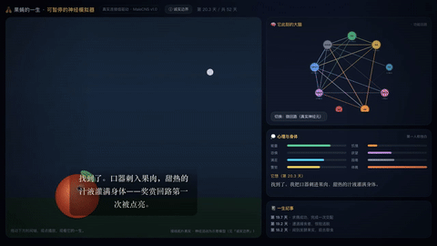

# 果蝇的一生 · 可暂停的神经模拟器

一只果蝇，由**真实果蝇全脑连接组（MaleCNS v1.0，FlyEM 联盟）**驱动，从卵 → 幼虫 → 蛹 → 成虫 → 死亡，在你面前活一遍。

它不是数据分析玩具，而是一台**共情与自省仪器**：你看着一个有真实大脑的微小生命，经历饥饿、欲望、恐惧、求偶、衰老、死亡，它的大脑回路随情境真实点亮，你能随时暂停，问自己「换成我呢？」

> 一只虫子被 hunger / fear / desire 推着走完一生——你今天，是被哪一股冲动推着走的？

---

## 核心特性

- **真实大脑底座**：9 个功能角色（MaleCNS 真实加权连边，44 条）+ 42 种真实神经元微回路（110 条真实连边），随情境点亮。可切「功能回路 / 真实神经元」两层。
- **第一人称心理独白 + 8 条内部状态**（能量 / 饥饿 / 恐惧 / 欲望 / 满足 / 困倦 / 警觉 / 体魄），实时跳动。
- **电影感画面**：胶片颗粒 + 暗角、章节卡（卵 → 幼虫 → 蛹 → 成虫）、Canvas 昼夜场景、振翅果蝇、捕食者阴影、一生纪事时间线。
- **你能控制**：▶ 播放 / ⏸ 暂停 / 0.5–4× 变速 / 拖拽时间轴任意定位（确定性引擎，拖到哪结果一致）/ 🎲 换一只（新命运）/ ⏸ **暂停思考**——弹出反思卡，把它的冲动镜像回你自己。
- **纪录片中文字幕 + 配音**：底部字幕随心境淡入淡出；🎙 旁白按钮用浏览器中文语音朗读，变成真正的配音短片。
- **可分享的反思卡片**：暂停思考时可存 1080×1350 PNG、复制文案，或把**某一瞬间的链接**发给别人（对方一打开就停在你分享的那一刻）。
- 1× 下整段约 **5 分钟**。

## 怎么打开

仓库里的 `flylife.html`、`index.html`、`collection.html`、`connectome.html` 都是**零外部依赖的自包含单文件**，直接双击用浏览器打开即可。建议从 `index.html` 进入。

也可以本地起一个服务预览：

```bash
cd flylife-publish
python3 -m http.server 8000
# 浏览器访问 http://localhost:8000
```

部署到任意静态托管（GitHub Pages / Vercel / 对象存储）即可拥有在线链接。

## 怎么重新生成

所有页面都由 `build_*.py` 从真实数据生成（纯 Python 标准库 + `pyarrow`）：

```bash
# 需要 circuit.json（已随仓库提供）与 pyarrow
python3 build_flylife.py     # → flylife.html（核心模拟器）
python3 build_collection.py  # → collection.html（多只果蝇合集）
python3 build_connectome.py  # → connectome.html（真实连接组网络图）
```

`circuit.json` 由 `build_circuit.py` 从公开的 1.1GB 权重表
`connectome-weights-male-cns-v1.0-minconf-0.5.feather`（FlyEM 联盟，
https://storage.googleapis.com/flyem-male-cns/）抽取而来；仓库已内置抽取结果，无需重新下载。

## 文件结构

| 文件 | 说明 |
|---|---|
| `flylife.html` | 核心：可暂停的果蝇生命模拟器 |
| `index.html` | 项目主页 / 分享入口 |
| `collection.html` | 16 只果蝇的「数字一生」合集（下拉切换） |
| `connectome.html` | 真实连接组网络图（功能回路层 + 真实神经元枢纽层） |
| `build_flylife.py` | 模拟器生成器 |
| `build_collection.py` / `build_connectome.py` | 合集 / 网络图生成器 |
| `build_circuit.py` `report.py` `flylife.py` `flylife_real.py` | 原始抽取与模拟管线 |
| `circuit.json` | 真实连接组子图（5,396 节点 / 289,144 真实突触连接 / 607 种神经元类型） |
| `test_circuit.json` | 引擎单测用的小样例 |

## 数据来源与诚实边界

- **真实的部分**：接线来自公开数据集 **MaleCNS v1.0**（FlyEM 联盟成年雄性果蝇中枢神经系统连接组）；底图共 **5,396 个神经元节点 / 289,144 条真实突触连接**，取自 **607 种真实神经元类型**；节点是真实神经元类型，连线粗细对应真实突触权重（真实突触计数之和）。
- **示意的部分**：这只果蝇「的一生」是程序生成的示意叙事，不是某只真实果蝇的记录；脑区「点亮」的强度与能量 / 饥饿 / 恐惧 / 欲望等状态是 **rate-based 简化模型**，非真实放电复现；图的布局（环形 / 力导向）只为可读性，不代表脑内真实空间位置。

**结论**：这是一件**模拟 / 科普 / 自省**作品——用真实的脑接线结构去讲一只果蝇「可能的一生」，**不声称复现意识或真实行为**。它的价值不在预测，而在让你照见自己。

## License

MIT © leo-bone

## 🎬 视频演示（5 分钟，含合成配乐与中文字幕）

**30 秒循环预览**（GitHub 页面内直接自动播放，无需下载）：



**完整 5 分钟成片**：一只果蝇由真实连接组驱动，从卵 → 幼虫 → 蛹 → 成虫 → 死亡，
结尾定格在「约 16 万个真实神经元（完整 MaleCNS v1.0 连接组 166,700 个）」反思卡。
（GitHub 的 README 不支持内联播放 mp4）▶ 点击下载观看：[media/flylife-life-5min.mp4](media/flylife-life-5min.mp4)
